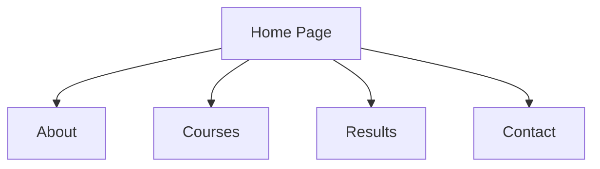
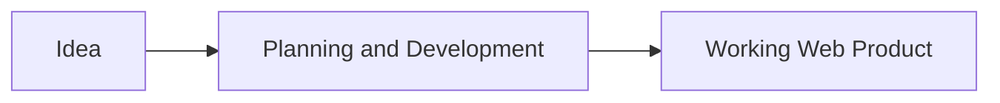
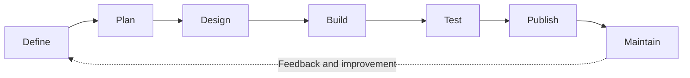
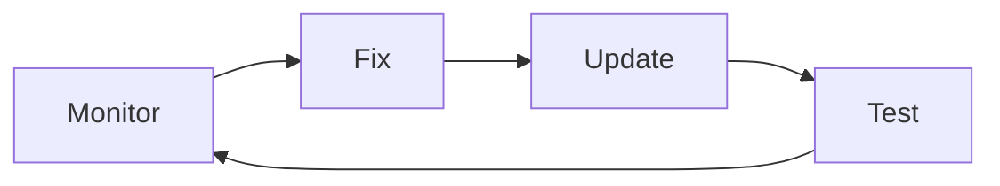

# What Is Web Development?

**Course:** Web Development Fundamentals  
**Video:** 01  
**Level:** Complete Beginner

## Learning Objectives

After completing this lesson, you should be able to:

- Explain web development in simple words.
- Distinguish between a web page, website, and web application.
- Describe why websites and web applications are developed.
- Identify the basic stages of the development process.
- Explain the general responsibilities of a web developer.
- Recognize the introductory roles of HTML, CSS, and JavaScript.
- Identify frontend, backend, and full-stack as broad development categories.
- Describe the qualities of an effective website.

---

## 1. The Web in Everyday Life

We use the web for many everyday activities:

- Reading news
- Watching online courses
- Shopping
- Booking tickets
- Sending email
- Managing money
- Searching for information
- Communicating with people

Each website or web application we use has been planned, designed, developed, tested, and maintained by someone.

---

## 2. Three Basic Web Terms

Before defining web development, we need to understand three basic terms.

### 2.1 Web Page

A **web page** is one individual document available on the web.

Examples include:

- A home page
- An about page
- A contact page
- A news article
- A product page

A web page may contain headings, paragraphs, images, videos, links, buttons, or forms.

**Simple analogy:** A web page is like one page in a book.

### 2.2 Website

A **website** is a collection of related web pages available under one identity.

For example, a school website may contain:

- Home
- About
- Courses
- Results
- Contact

These pages are connected through navigation so visitors can move from one page to another.

**Simple analogy:** If a web page is one page of a book, a website is the complete book.

### 2.3 Web Application

A **web application** is software that users access through the web to perform tasks.

Users may be able to:

- Sign in
- Search for information
- Create or edit content
- Make bookings
- Complete transactions
- Manage an account

Examples include Gmail, Google Docs, online banking platforms, and booking applications.

The main idea is interaction. A user does more than simply read information.

---

## 3. Website vs Web Application

| Website | Web Application |
|---|---|
| Mainly presents information | Mainly helps users perform tasks |
| Visitors usually read and explore | Users actively interact and create |
| Example: news website | Example: email service |

The boundary is not always strict. Many modern web products combine both.

For example, an online shopping website provides product information, but it also lets users search, add items to a cart, place orders, and make payments.

### Levels of Interaction

Web products can offer different levels of interaction:

1. **Read:** View information, such as an article.
2. **Explore:** Search or navigate through content.
3. **Respond:** Submit information through a form.
4. **Complete a task:** Book, buy, create, or manage something.

The required level of interaction depends on the product's purpose.

---

## 4. Meaning of Web Development

**Web development is the process of creating, building, testing, and maintaining websites and web applications.**

It turns an idea or requirement into a working web experience.

A simple development journey looks like this:

Web development is not limited to writing code. It can involve:

- Understanding the goal
- Planning pages and features
- Organizing content
- Building the product
- Testing user actions
- Fixing errors
- Publishing the website
- Updating it after launch

---

## 5. Why Do We Develop Websites?

People and organizations develop websites to achieve specific goals.

### Share Information

Schools, news organizations, teachers, and businesses can publish useful information online.

### Provide Services

Organizations can offer services such as appointment booking, online learning, or customer support.

### Communicate With Users

A website can provide contact forms, announcements, feedback options, and other communication methods.

### Sell Products

Businesses can display products and allow customers to order them online.

### Complete Tasks

Users can submit applications, book tickets, edit documents, or manage accounts.

### Reach More People

A web product can make information and services available to people in different locations.

Every useful website should have a clear purpose.

---

## 6. What a Working Website Needs

Three important aspects work together in a website.

### Content

Content is the information presented to users.

Examples:

- Words
- Images
- Videos
- Documents

### Appearance

Appearance controls how the content is presented.

It includes:

- Layout
- Colours
- Typography
- Spacing

### Functionality

Functionality allows users to perform actions.

Examples:

- Opening links
- Clicking buttons
- Searching
- Submitting forms
- Downloading files

Content, appearance, and functionality should all support the website's purpose.

---

## 7. House-Building Analogy

Building a website is similar to building a house because both require planning, construction, testing, and maintenance.

| Building a House | Building a Website |
|---|---|
| Understand the need | Define the website's goal |
| Create a plan | Plan pages and features |
| Construct the house | Build the website |
| Inspect the work | Test the website |
| Repair and maintain | Update and improve the website |

The analogy shows that developers should not begin with random coding. They first need to understand what they are building and why.

---

## 8. Basic Development Process

### Step 1: Define the Goal

Identify the website's purpose, intended users, and the problem it should solve.

### Step 2: Plan the Pages and Features

Decide which pages and functions the website needs.

### Step 3: Design the Experience

Plan the layout, appearance, navigation, and user experience.

### Step 4: Build the Website

Turn the plan and design into a working web product.

### Step 5: Test the Result

Check whether the pages, links, buttons, forms, and other features work correctly.

### Step 6: Publish for Users

Make the completed website available to its intended users.

### Step 7: Maintain and Improve

Update information, fix problems, and improve the website over time.

Development is often iterative. Testing and feedback may reveal a need to revisit an earlier stage.

---

## 9. What Does a Web Developer Do?

A web developer may:

- Understand project requirements
- Build web pages and features
- Connect different parts of the website
- Test user actions
- Find and fix errors
- Improve performance and usability
- Update the website when requirements change

The exact responsibilities depend on the developer's role and the size of the project.

---

## 10. Web Design vs Web Development

| Web Design | Web Development |
|---|---|
| Plans the visual experience | Builds the working website |
| Chooses layout, colours, and typography | Adds functionality |
| Considers navigation and user experience | Tests and maintains the result |

Design plans the experience. Development turns the plan into a functional product.

Designers and developers often collaborate. In a small project, one person may perform both roles.

---

## 11. Common Starting Technologies

### HTML

**HTML** organizes the content and structure of a web page.

It identifies elements such as headings, paragraphs, images, and links.

### CSS

**CSS** controls presentation and layout.

It is used for colours, spacing, typography, positioning, and responsive layouts.

### JavaScript

**JavaScript** adds behaviour and interaction.

It can make a page respond when a user clicks a button, submits a form, or performs another action.

At a beginner level, remember:

- HTML provides structure.
- CSS controls presentation.
- JavaScript adds interaction.

---

## 12. Common Categories of Web Development

### Frontend Development

Frontend development focuses on the part users see and interact with.

### Backend Development

Backend development focuses on behind-the-scenes functionality and data-related work.

### Full-Stack Development

Full-stack development involves work across both frontend and backend areas.

These are introductory definitions only. Frontend, backend, and full-stack development will be explained in dedicated videos later in the course.

---

## 13. People Involved in a Web Project

A web project may involve:

- **Project owner:** Defines the project's goal.
- **Designer:** Plans the visual experience.
- **Developer:** Builds the working product.
- **Content creator:** Prepares text, images, and other media.
- **Tester:** Finds problems before users encounter them.

A large project may have separate people for each responsibility. One person may handle several roles in a small project.

---

## 14. Practical Example: Coaching Website

Imagine a teacher needs a coaching website.

### Goal

Help students and parents learn about available classes and contact the teacher.

### Possible Pages

- Home
- Classes
- Study Material
- About
- Contact

### Useful Features

- Course information
- Downloadable notes
- Contact form

Each page and feature should support the main goal. Features that do not help students, parents, or the teacher may add unnecessary complexity.

---

## 15. Website Maintenance

Development continues after a website is launched.

Developers may need to:

- Update outdated information
- Fix broken features
- Improve speed and usability
- Add new features
- Support new devices
- Respond to changing user needs

A simple maintenance cycle is:

Regular maintenance helps keep a website useful and reliable.

---

## 16. What Makes a Website Effective?

An effective website:

- Has a clear purpose
- Provides useful content
- Is easy to navigate
- Works as expected
- Adapts to different screen sizes
- Can be used by people with different abilities

### Responsive Design

A responsive website adjusts its layout for different devices, such as desktops, tablets, and mobile phones.

### Accessibility

Accessibility means creating a website that people with different abilities can use.

A website should not be judged only by how attractive it looks. It should also be clear, useful, functional, and accessible.

---

## 17. Common Misunderstandings

### “Web development means only coding.”

Web development also includes planning, design collaboration, testing, fixing, publishing, and maintenance.

### “A website is one page.”

A website can contain many connected web pages.

### “Web design and web development are the same.”

They have different responsibilities, although they often work together.

### “Every website is built in the same way.”

The approach depends on the website's purpose, users, features, and requirements.

---

## 18. Knowledge Check

Try answering these questions before looking at the answers.

1. What do we call one individual online news article?
2. What do we call a school site containing Home, About, and Contact pages?
3. What do we call an online document editor that lets users create and edit content?
4. What is the complete process of planning, building, testing, and updating web products called?
5. Which technology organizes page structure?
6. Which technology controls presentation and layout?
7. Which technology adds behaviour and interaction?

### Answers

1. Web page
2. Website
3. Web application
4. Web development
5. HTML
6. CSS
7. JavaScript

---

## 19. Lesson Summary

- A web page is one individual document on the web.
- A website is a collection of related web pages.
- A web application helps users perform tasks through the web.
- Web development creates, builds, tests, and maintains web products.
- A working website combines content, appearance, and functionality.
- Development follows a process: define, plan, design, build, test, publish, and maintain.
- HTML provides structure, CSS controls presentation, and JavaScript adds interaction.
- Frontend, backend, and full-stack are broad categories of web development.
- Effective websites are clear, useful, functional, responsive, and accessible.
- Website maintenance continues after launch.

## Next Lesson

**Video 02: How the Internet Works**

The next lesson will answer an important question: How does a website reach a user's screen?

---

**OutLearn360**  
*Learn • Understand • Build*

